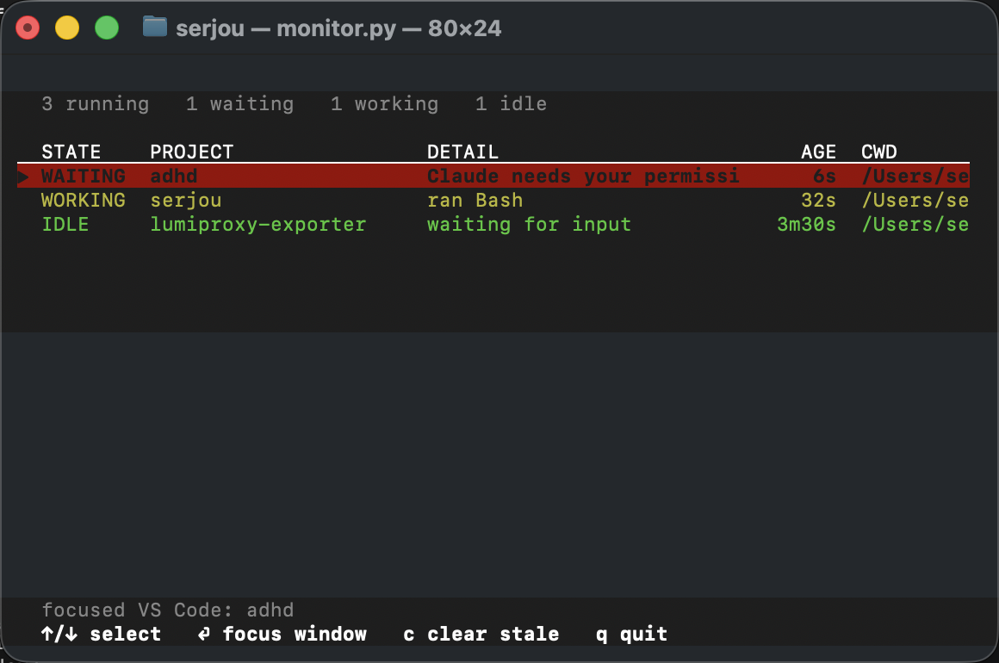
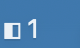
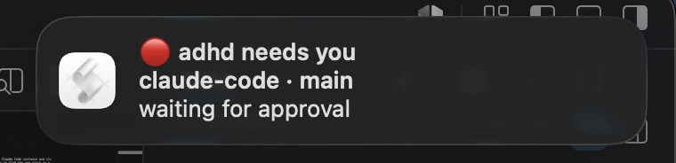

# adhd

A live terminal dashboard that shows every running Claude Code instance and its
state, so you don't have to switch between projects to find the one stuck on a
`yes / don't ask again` permission prompt. Select a session and hit Enter to jump
straight to its window.



## Install

```bash
git clone https://github.com/serjou1/adhd.git ~/.claude/adhd
python3 ~/.claude/adhd/install.py
```

The installer drops an `adhd` command on your PATH and wires the Claude Code
hooks. (The repo is private — `git clone` uses your existing GitHub credentials.)

## Quick start

```bash
adhd
```

That's it. It refreshes every second and picks up every Claude Code session
automatically. No setup per project. Runtime state lives in `~/.adhd/state`
(override with `ADHD_STATE_DIR`).

## Menu bar (macOS)

Don't want a whole terminal pane? `adhd-menu` puts a status-bar icon up top with
a badge counting the sessions **WAITING** on a permission prompt — the ones that
literally need your click. `◧ 2` means two sessions are blocked.



```bash
adhd-menu                     # run it now
python3 install.py --login    # ...or auto-start it at login
```

Click the icon for a live menu:

```
  1 waiting · 1 limited · 2 working · 4 idle
  ───────────────────────────────
  🔴  arbitrage-core — Claude needs your permission (12s)
  🟣  backtester — rate-limited (4m)
  🟡  statistics-service — ran Bash (1s)
  🟢  twitter-crawler — waiting for input (47s)
  ───────────────────────────────
  Open adhd monitor…
  ✓ Notifications
  ✓ Repeat reminders (10 min)
    Auto-resume rate-limited
  ───────────────────────────────
  Quit
```

Pick any session to bring its window to the front (same focus logic as the
dashboard — tmux pane, iTerm/Terminal tab, or VS Code window). **Open adhd
monitor…** launches the full curses dashboard in a new Terminal window. The
badge hides when nothing is waiting. Override the glyph with `ADHD_MENU_ICON`.

### Notifications

While `adhd-menu` is running it pops a macOS notification when a session needs
you, so you can work in one window and get pulled back to another only when it
matters:

| When | Notification |
|------|--------------|
| A session **finishes its turn** (working → idle) | ✅ *project* — done |
| A session **blocks on a permission prompt** (needs access) | 🔴 *project* needs you |
| A blocked session is **still waiting** after 10 min (repeat reminders on) | 🔴 *project* still needs you |
| A session **hits a usage / rate limit** (waiting for reset) | 🟣 *project* rate-limited |



Toggle notifications from the menu (**Notifications**), or start muted with
`ADHD_NOTIFY=0`. No burst on startup — already-running sessions are seeded
silently and only *transitions* after that fire a toast.

**Repeat reminders** (on by default) nudge you again every 10 minutes about a
session that's *still* blocked on a prompt — so a banner you missed comes back
instead of being lost. The moment the session stops waiting (you approve, or it
moves on) the reminders stop. Toggle them from the menu (**Repeat reminders**),
or start them off with `ADHD_NOTIFY_REPEAT=0`; change the interval (seconds)
with `ADHD_NOTIFY_REPEAT_SECS`.

### Auto-resume rate-limited sessions

**Off by default.** Turn it on (menu → **Auto-resume rate-limited**, or start
with `ADHD_AUTO_RESUME=1`) and `adhd` will pick a stalled session back up for
you: when a session is blocked on a usage / rate limit, it waits out a cooldown,
confirms the network is reachable, then **types a short prompt into that exact
session** to push it forward. So a limit you hit while offline resumes when the
connection returns, and a usage cap resumes after it resets — without you
babysitting the terminal.

It opts in because it *types into your terminal*. To stay safe it only nudges
sessions it can target precisely — a tmux pane, an iTerm session id, or a
Terminal tab matched by tty — so a keystroke can never land in the wrong window.
VS Code sessions (no scriptable terminal) are left alone. A session that's still
limited is retried after each cooldown, not hammered every tick, and only the
first nudge of an episode toasts (**↩️ *project* — resuming**).

| Variable | Default | Meaning |
|----------|---------|---------|
| `ADHD_AUTO_RESUME` | `0` (off) | Set to `1` to start with auto-resume on |
| `ADHD_RESUME_TEXT` | `continue` | The prompt typed into the session to resume it |
| `ADHD_AUTO_RESUME_SECS` | `300` | Cooldown between retries while still limited (seconds) |

Clicking a toast brings the waiting session's window to the front. To land on a
specific one when several need you, click the menu-bar icon and pick it there.

> **How the click works.** A macOS banner is "owned" by whatever app calls
> `display notification`, and clicking it opens that app. A bare `osascript`
> toast is owned by Script Editor — which is why clicks used to pop *it* open.
> So on first use `adhd` builds a tiny applet at `~/.adhd/adhd.app` (via
> `osacompile`, branded `com.adhd.notifier` and ad-hoc signed) and posts every
> banner *through it*. The banner is now owned by adhd, and clicking it
> relaunches the applet, which focuses a waiting session (`menubar.py --focus`).
> The applet rebuilds itself if deleted; the first banner from it may need
> approving once in **System Settings → Notifications → adhd**.
>
> The modern `UNUserNotificationCenter` API could target the exact window per
> banner, but it needs a fully packaged, signed `.app`; the old CLI tools
> (`terminal-notifier`, `alerter`) are dead on macOS 14+ — they use the removed
> `NSUserNotification` API and silently never appear.

> Needs the `rumps` package (a tiny PyObjC wrapper). `install.py` installs it for
> you; otherwise `pip3 install --user rumps`.

## What you see

```
  Claude Code Monitor
  5 running   1 waiting   1 limited   2 working   1 idle
  STATE    PROJECT                DETAIL                       AGE  CWD
  WAITING  upbit-crawler          needs permission to use...   12s  /Users/serjou/upbit-crawler
  LIMIT    backtester             usage limit reached           4m  /Users/serjou/backtester
  WORKING  arbitrage-core         ran Bash                      3s  /Users/serjou/arbitrage-core
  WORKING  statistics-service     Bash                          1s  /Users/serjou/statistics-service
  IDLE     twitter-crawler        waiting for input           47s  /Users/serjou/twitter-crawler
```

| State              | Meaning                                                        | What to do        |
|--------------------|----------------------------------------------------------------|-------------------|
| **WAITING** (red)  | Blocked on a permission / approval prompt — needs your click   | Go to that one    |
| **LIMIT** (magenta) | Hit a usage / rate limit — blocked on the clock, not on you   | Wait for reset, or switch session |
| **WORKING** (yellow) | Actively processing a prompt or running a tool               | Leave it alone    |
| **IDLE** (green)   | Finished its turn, sitting at the prompt for your next message | Free when you are |

Rows are sorted so WAITING is at the top, then LIMIT, then the rest.

## Keys

| Key | Action |
|-----|--------|
| `↑` / `↓` (or `k` / `j`) | Move the selection (spans live sessions **and** recently-closed rows) |
| `⏎` Enter | Live row → focus its window. Recently-closed row → open it fresh |
| `r` | Recently-closed row → resume its previous conversation (`⇧⏎` works too on modifier-reporting terminals; see below) |
| `c` | Clear stale entries (sessions older than 6h that never sent a clean exit) |
| `q` | Quit the dashboard |

### Jumping to a session's window

Select a row and press Enter to bring its terminal to the front. The hook records
how each session was launched and the dashboard picks the best focus method:

| Terminal | How it focuses | Precision |
|----------|----------------|-----------|
| **tmux** | `tmux select-window` + `select-pane` on the recorded pane | exact pane |
| **iTerm2** | AppleScript match on `ITERM_SESSION_ID` | exact tab/session |
| **Terminal.app** | AppleScript match on the tab's `tty` | exact tab |
| **VS Code** (one window per session) | `code <project-root>` focuses the window that has that folder open | exact window |
| other | activates the app (can't target the exact pane) | app only |

The result of each jump is shown just above the footer. Sessions that were
already running before this feature was installed have no captured window info —
restart them (or just let them fire one more event) and they'll become jumpable.

> **VS Code jumping uses the `code` CLI** — no Accessibility permission needed.
> `code <folder>` brings an already-open window for that folder to the front.
> The target folder is the session's **git root** (so a session started in a
> deep subdir like `crates/foo/src` still resolves to the `arbitrage-core`
> window), falling back to the cwd for non-git folders. This is also why the
> `PROJECT` column shows the repo name instead of the subdir name. Requires the
> `code` command on your PATH — in VS Code run *Shell Command: Install 'code'
> command in PATH* if it's missing.

### Recently closed (history)

Below the live sessions the dashboard shows a **recently closed** section: the
last 10 distinct projects whose sessions have ended. Select one to re-open it
**where it lived** — VS Code sessions re-open the project folder in VS Code
(`code <root>`, the window the session ran in); iTerm / Terminal sessions open a
fresh window in that app, `cd`'d into the project root.

Two ways to re-open, so resuming is a deliberate choice:

| Key | Does |
|-----|------|
| `⏎` | **Open** a fresh `claude` in the project (a clean slate) |
| `r` | **Resume** — `claude --resume <session_id>`, bringing back the *exact* previous conversation (`⇧⏎` also works on modifier-reporting terminals) |

The session id is remembered in the history entry (alongside the project root
and the terminal it ran in), which is what makes resume possible. VS Code
sessions always just open the folder — resume `claude` yourself in its
integrated terminal, where the session lived.

> **Heads-up on `⇧⏎`:** most terminals (Terminal.app, default iTerm2) send the
> *same* byte for `⏎` and `⇧⏎`, so they can't be told apart unless the terminal
> reports modifier keys (kitty, or iTerm2/xterm with CSI-u / *modifyOtherKeys*
> enabled). **`r` always works** — use it if `⇧⏎` opens fresh on your terminal.

A project is recorded as closed whether it ended cleanly (`SessionEnd`) or was
killed/force-closed (the reaper notices its terminal is gone). The list lives in
`~/.adhd/history.json` on disk, so it **survives restarts, updates, and power
loss**: whatever was open before a crash lands in history the next time the
dashboard runs and reaps its leftover state file. (Leftover files from before the
last reboot are reaped on sight — their `tty` may have been reused, so trusting
it would risk a stale or mis-targeted row.) A project that's open again is hidden
from the list until it closes once more.

## How it works

1. Claude Code fires **hooks** on lifecycle events (prompt submitted, tool about
   to run, permission notification, turn finished, session ended).
2. `hook.py` runs on each event and writes a small JSON state file to
   `~/.adhd/state/<session_id>.json`.
3. `monitor.py` polls that folder once a second and renders the table.

Event → state mapping (in `hook.py`):

| Hook event        | State it sets        |
|-------------------|----------------------|
| `SessionStart`    | idle                 |
| `UserPromptSubmit`| working              |
| `PreToolUse`      | working (tool name)  |
| `PostToolUse`     | working              |
| `Notification`    | **waiting** (permission), **limit** (usage/rate limit), or idle (idle prompt) |
| `Stop`            | idle (done)          |
| `SessionEnd`      | removed from dashboard, recorded in **recently closed** |

## Files

| Path | Role |
|------|------|
| `install.py`              | One-shot installer: adds the `adhd` / `adhd-menu` commands, wires the hooks, installs `rumps` (`--login` adds a LaunchAgent). |
| `hook.py`                 | Event handler; writes per-session state, records closes to history. Always exits 0 so it can't break a session. |
| `monitor.py`              | The terminal dashboard (also the shared session-loading / window-focus / re-open layer). |
| `menubar.py`              | The macOS menu-bar app. Reuses `monitor.py`'s loading + focus logic. |
| `history.py`              | Recently-closed project store (load / record). Shared by `hook.py` and `monitor.py`. |
| `~/.adhd/state/`          | One JSON file per live session (override with `ADHD_STATE_DIR`). |
| `~/.adhd/history.json`    | The last 10 closed projects, for re-opening (survives restarts/power loss). |
| `~/.claude/settings.json` | Holds the global `hooks` block that wires the events to `hook.py`. |

## Notes & troubleshooting

- **A session isn't showing up?** Sessions already open before the hooks were
  installed may not report. Restart that `claude` and it will appear. New
  sessions are picked up automatically.
- **A permission prompt didn't turn a row red?** The "waiting" detection relies
  on the `Notification` hook. If a prompt isn't classified as waiting, adjust the
  keyword matching in the `classify()` function in `hook.py`.
- **A crashed/force-closed session lingers.** It never sends `SessionEnd`, but
  the monitor auto-reaps it: each refresh it drops any session whose terminal
  (`tty`) no longer has a live `claude` process (and any left over from before
  the last reboot). Reaped sessions are recorded in **recently closed** so you
  can re-open them. Sessions whose tty wasn't captured (or if the process list
  can't be read) are kept, and `c` still clears anything with no update for 6h as
  a backstop.
- **"No sessions reporting yet."** Normal when no Claude Code instances are
  running, or none have fired an event since install.
